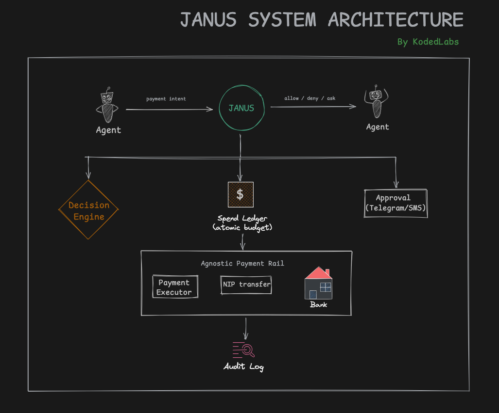

# Janus — Product Requirements Document

**Owner:** Koded (Koded Labs)
**Status:** Draft, active build (day 2)
**One-liner:** A self-hosted policy gate that lets an AI agent move real naira within rules you set, and refuses everything else.
**Positioning:** Naira-first. The governance layer for African fiat agent payments, the corner the global players have written off.

---

## 0. The end goal (read this first)

Janus is a **portfolio build**, and the scoreboard is set accordingly. Success is not users, revenue, or market share. Success is:

1. A working gate that moves real naira on a live rail, gated by policy, with a clean audit trail, demoable in two minutes.
2. Proof that I identified the most contested layer of the agentic-payments stack (authorization and governance) early, and shipped it end to end while most people were still writing explainers.
3. A stronger fintech resume opener than the Go database or the old Janus. KodedDB proved I can implement hard things others specify. Janus proves I can see where an industry is going and build the missing piece before it's obvious. Fintechs pay more for the second.
4. A credible reason to be in the room with the people building this: Skyfire, Paystack, Stripe, the agent-wallet crowd.

What Janus is explicitly **not** trying to be: a startup. Companies have raised up to roughly $10M in this space, which proves the problem is real and worth building against. It does not mean a solo, self-hosted, naira gate is a venture. The raises validate the space, not this entry into it. Holding that line is what keeps the project honest and finishable.

If this ever grew beyond a portfolio piece, the only defensible version is the local wedge in section 3, not a head-on fight with Crossmint or Stripe.

## 1. Background

Janus v1 died of scope creep: it tried to be a yield optimizer, a zero-knowledge identity layer, an MPC custody wallet, and a breach-response system at once. This rebuild keeps exactly one piece, the piece the "How does the internet pay?" write-up concluded was the actual hard problem: the trust layer that decides whether a software agent is allowed to spend money.

The industry has since converged on the same idea. Google's AP2 and Stripe/Tempo's MPP are authorization layers that stop short of moving money. Stripe's own community filed the gap on its agent toolkit: money movement and governance are separate layers, and restricted API keys control which APIs an agent can call but not how much it can spend, to whom, per task. Janus is that governance layer, self-hosted, wired to a live Nigerian rail.

## 2. Problem statement

When an autonomous agent initiates a payment, the assumption every payment system was built on, that a human is present to confirm, breaks. Without a gate, an agent that can pay can also overpay, pay the wrong party, be manipulated into a bad payment, or double-pay on a retry. Janus is the gate that makes agent-initiated payments safe enough to actually switch on.

## 3. Positioning: the local wedge

Every funded player (Crossmint, Skyfire, FluxA, Nevermined) is chasing global, card-network and stablecoin-first, enterprise agent commerce. None of them will seriously touch Nigerian bank rails, naira, NIP quirks, or local compliance for years. That is the wedge.

Janus is built naira-first: NIP transfers, Paystack recipients, local categories (airtime, data, vendor payouts), Telegram approvals. It is the governance layer for the exact world Paystack Index is opening up on the consumer side. Paystack Index lets a Nigerian ask an AI assistant to buy airtime, send money via Zap, or order food, within permissions and spending limits. Janus is the developer-facing control layer for that same shift: the gate you put in front of your own agent.

The tie is not just thematic. It is the clearest local proof that agent-initiated fiat payments with spending limits are already shipping here, which makes Janus timely rather than speculative.

## 4. Non-goals (the kill list)

If a feature is on this list, it does not go in Janus. It becomes a separate project or it does not exist.

- No yield optimization or fund allocation.
- No identity, KYC, or proof-of-personhood.
- No breach detection or automated move-to-safety.
- No custody of the user's main funds. Janus only ever touches the float.
- No multi-tenant SaaS, dashboards, or billing in this cycle. Single user, self-hosted.

## 5. What I'm implementing (the protocol stance)

Janus is not a new payment protocol. It is the **authorization and policy-enforcement layer**, and it speaks an AP2-shaped model so it is standards-ready. Implement four contracts and nothing more:

1. **Standing authorization (user → Janus):** the policy JSON. Modeled on an AP2 **Intent Mandate**, the scope signed once (caps, categories, recipients, validity).
2. **Payment intent (agent → Janus):** one proposed payment, modeled on an AP2 **Payment Mandate** request.
3. **Decision + receipt (Janus → agent and → audit log):** allow / deny / needs-approval, with reason, plus the rail reference on success.
4. **Rail adapter (Janus → rail):** `execute(payment) -> receipt`. The only part that knows about Paystack.

**Do not build yet:** real W3C Verifiable Credential signing with ECDSA mandates. Mirror the AP2 shape in JSON so a real mandate-signing adapter is a later drop-in. For v1 the "signature" is a signed session token or HMAC. Cryptographic mandate plumbing is exactly the kind of thing that reopens the v1 scope spiral.

## 6. Rails

| Rail | Role | Money | Guardrails live where |
|------|------|-------|----------------------|
| **Paystack** | Local, first | Real naira over NIP | Entirely in Janus (rail has no agent controls) |
| **Stripe** | International, second | Test mode (real API) | Split: Stripe Issuing hard floor + Janus soft policy |
| **x402 / USDC** | Borderless, deferred | Later | Wallet signature is the mandate |

Paystack carries the live-money proof and is the whole point of the local wedge. Stripe is proven in global test mode to demonstrate the rail-agnostic claim and that Janus composes with a rail that has its own controls. x402 is a deliberately deferred adapter, same interface, kept off the critical path because the goal is normal money now.

```python
class Executor(Protocol):
    async def execute(self, payment: Payment) -> Receipt: ...

class PaystackExecutor:   # Janus is the sole guardrail
    async def execute(self, payment): ...   # Transfers API -> NIP
```

## 7. Non-negotiable features

Ranked so that if any is missing, Janus is broken or dangerous, not merely incomplete.

1. **Idempotency.** Same `idempotency_key` pays at most once, ever. The single most important line of code here.
2. **Atomic budget accounting.** Two concurrent intents cannot both pass a cap only one fits under. Redis atomic decrement, not read-then-write.
3. **Hard float ceiling, enforced independently of policy.** Even a misconfigured policy cannot exceed the funded float.
4. **Deterministic decision with a reason.** Allow / deny / needs-approval, always with a human-readable reason.
5. **Human-in-the-loop escalation.** A real blocking approval path over Telegram, timing out to deny.
6. **Append-only audit log.** Every decision, with reason and rail reference, never edited in place.

Four of six are correctness and safety, not features. That is the tell that this is infrastructure.

## 8. Developer experience

**Setup (once):**

```python
janus.set_policy({ ... })          # the policy in section README
janus.add_recipient("0123456789", bank="Access")
# fund the float out of band via Paystack
```

**Runtime (per payment):**

```python
decision = janus.pay(
    amount_ngn=150,
    recipient="0123456789@Access",
    category="vendor-payout",
    reason="Groundnut supplier, order #A12",
    idempotency_key="order-A12-payout",
)
```

**Output object (three shapes):**

```json
// allowed
{ "id": "dec_9f2", "status": "allowed", "reason": "within all limits",
  "receipt": { "rail": "paystack", "rail_reference": "TRF_8x2", "amount_ngn": 150 },
  "remaining_daily_ngn": 1850 }

// denied
{ "id": "dec_9f3", "status": "denied", "reason": "recipient not in allowlist",
  "receipt": null, "remaining_daily_ngn": 1850 }

// needs_approval
{ "id": "dec_9f4", "status": "needs_approval",
  "reason": "amount 500 exceeds per_tx_cap 200",
  "approval_url": "tg://janus/approve/dec_9f4", "expires_at": "2026-07-12T22:14:00Z" }
```

**Distribution:** expose Janus as an **MCP server** with one tool, `pay`. Any agent (Claude, OpenAI Agents SDK, LangChain) then sees a `pay` tool with the guardrails already inside. Two-line adoption, not a rewrite.

## 9. Architecture



- **API layer (FastAPI):** intent intake plus read endpoints for policy and audit.
- **Decision engine:** pure function of `(intent, policy, spend_state, float_limit_ngn) -> verdict`. No side effects. Most-tested part. `float_limit_ngn` is passed separately from `policy` so the hard float ceiling (§7.3) holds even when the policy itself is wrong.
- **Spend ledger:** Redis atomic counters for daily total, velocity window, and the standing float ceiling; Postgres for the durable ledger and audit trail; idempotency keys deduplicate.
- **Approval channel:** Telegram bot (reuse KODED OS) today; SMS is a documented later option, not yet built. Publish request, await callback, return verdict.
- **Executor:** `PaystackExecutor` implementing the `Executor` interface — the only rail-aware piece, boxed as the "agnostic payment rail" in the architecture diagram.

## 10. Data model (sketch)

- **policy:** the JSON, one active version per user, versioned on change.
- **intent:** id, amount, recipient, category, reason, idempotency_key, received_at.
- **decision:** intent_id, verdict, reason, evaluated_at, policy_version.
- **transfer:** decision_id, rail, rail_reference, status, amount, settled_at.
- **audit:** the append-only join of the above, human-readable.

## 11. Scale and security (defined tightly, to avoid the trap)

"Build for scale and security" must not reopen the scope spiral. Concretely:

- **Scale means:** the decision path is stateless (any instance can serve any request) and the ledger stays correct under concurrent load. Proven by **one** load test that fires overlapping intents against a shared budget and shows zero overspend and zero double-pays.
- **Security means:** the float ceiling holds independently of policy, secrets live only in env, the audit log is append-only, and idempotency blocks replays. Backed by **one** short threat model in the README (rogue agent, replayed request, leaked key, misconfigured policy) with the mitigation for each.

That is the whole bar. One load test, one threat model. Not multi-tenancy, not k8s, not a dashboard.

## 12. Milestones (time-scoped)

Target: a focused weekend, roughly 10 to 14 hours, reusing the KODED OS Telegram bot.

| Phase | Deliverable | Est. | Gate to next |
|-------|-------------|------|--------------|
| **P0 — Core gate** | Decision engine + spend ledger + audit, unit-tested, no real payments | 3–4h | Correct and idempotent under a concurrency test |
| **P1 — Paystack (test)** | Executor on Paystack test keys; `allowed` triggers a test transfer end to end | 2–3h | Intent → decision → test transfer → logged |
| **P2 — Approval loop** | Telegram approval on `needs_approval`, blocking, timeout-to-deny | 2h | Over-cap intent pings phone and honors the reply |
| **P3 — Live cutover (DoD)** | Live keys, ₦2,000 float, allowlisted recipients; real naira moves | 1–2h | A real small transfer lands, gated and logged |
| **P4 — Harden + demo** | Load test, threat model, MCP `pay` tool, record the two-minute clip | 2–3h | Full demo runs start to finish on camera |

**One-night MVP cut:** P0 + P1. A working, idempotent gate moving money in Paystack test mode. P3 turns "works" into "moves real naira" and depends on Paystack live access being sorted.

### Definition of done

All true at once:

1. An agent submits an intent and gets a decision in well under a second.
2. A real Paystack transfer of a small naira amount, triggered by an `allowed`, lands in a real bank account.
3. A payment above the per-tx cap triggers a Telegram approval and only proceeds on yes.
4. A payment to a non-allowlisted recipient or over the daily cap is denied with a reason and moves no money.
5. Every case appears in the audit log with decision, reason, and (for transfers) the Paystack reference.
6. Replaying the same intent twice moves money at most once.

## 13. Competitive reality (why the wedge, in one glance)

The generic feature set (spending limits, merchant allowlists, human approval, audit logs) is the category floor, not a moat: Crossmint, Skyfire (about $9.5M raised), FluxA, Nevermined, and Payman all ship it, and the rails themselves (Stripe Issuing, and Stripe's roadmap to add spending limits) are absorbing it. Competing globally on features is a losing game. Competing locally on naira, NIP, and Nigerian rails is a game nobody else is playing. Hence the wedge. This is not the differentiator for a company; it is the reason this is a portfolio build with a sharp, defensible story rather than a doomed startup.

## 14. Risks and mitigations

| Risk | Mitigation |
|------|-----------|
| Live Paystack needs verification / OTP | All dev in test mode; live is a config flip once verified |
| Concurrency causes overspend | Atomic Redis decrement + idempotency; explicit concurrency test in P0 |
| Scope creep back toward v1 | Section 4 kill list is the contract; re-read before adding anything |
| "Build for scale" balloons into infra theatre | Section 11 caps it at one load test and one threat model |
| Agent manipulated into a bad payment | Recipient allowlist + per-tx cap + approval threshold contain it |
| Key leak | Float ceiling caps loss; env-only secrets; rotate on suspicion |

## 15. Open questions

- Primary demo operation: vendor payout (assumed) or airtime/data purchase? Swaps the executor call, not the gate.
- Approvals expire to deny (assumed, safer) or stay pending?
- Wire Stripe test mode in P4 as proof of rail-agnosticism, or leave it as a documented v2 flex?

---

## Personal notes

*Written to future-me, so I remember why this exists and don't lose the plot.*

- **Where it came from.** This started as late-night boredom after the "How does the internet pay?" article. The thesis of that whole piece was: not making payments autonomous, making autonomous payments trustworthy. Janus is that one sentence, built. Keep it that focused.

- **The scoreboard.** This is a portfolio build. If I catch myself thinking "people raised $10M, maybe this is a startup," stop. The raises prove the space is real, which is exactly why building in it is smart. They do not mean a solo naira gate is a company. The win is proving I saw the frontier and shipped the missing layer on live rails. That is enough, and it is rare.

- **The scope discipline.** v1 died because it tried to be four products. "Build for scale and security" is the new temptation to overbuild. The scalable, secure Janus is still just the gate: stateless decision path, atomic ledger, float cap, immutable audit. One load test, one threat model. If I'm adding a dashboard or multi-tenancy, I've lost the plot again.

- **The resume framing.** This replaces KodedDB and old-Janus as my fintech opener. Lead with "identified and shipped the governance layer that Stripe, Skyfire, and Crossmint are all racing to build, on live African rails," not "wrote a B+ tree and a WAL." One says implementer. The other says someone who picks the right problem. Aim for the second.

- **Skyfire outreach.** Message them as a peer who did the work, not a fan asking to be hired. Lead with the demo and one specific point where self-hosted governance and their network/KYA model diverge. Founders are Amir Sarhangi and Craig DeWitt; an engineer on the team may be a better first contact than the CEO. Reply-worthy beats flattering.

- **Paystack Index.** It's the local, consumer proof that this exact shift is already shipping in Nigeria. Use it in the story. (And yes, still low-key waiting to see if the LinkedIn post gets a peak response. Either way, the build is the real move.)

- **The corner.** Own the corner they cut off. Naira, NIP, local rails, local compliance. It's the more defensible version and it's the more me version. That's the whole point.